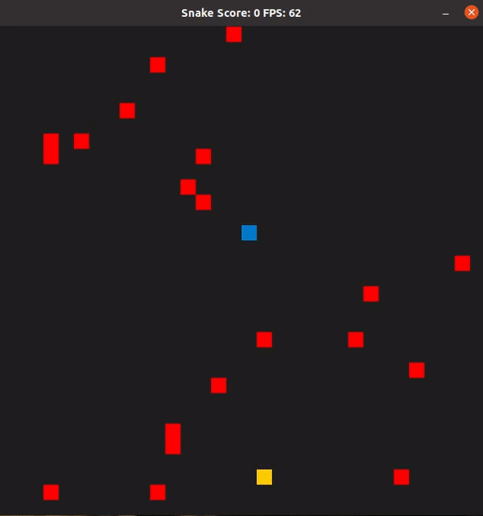

# CPPND: Capstone Snake Game

This is a starter repo for the Capstone project in the [Udacity C++ Nanodegree Program](https://www.udacity.com/course/c-plus-plus-nanodegree--nd213). The code for this repo was inspired by [this](https://codereview.stackexchange.com/questions/212296/snake-game-in-c-with-sdl) excellent StackOverflow post and set of responses.

In this project I extended a basic version of the [Snake Game](https://github.com/udacity/CppND-Capstone-Snake-Game) with additional [Features](#features) by following the principles I learned throughout the C++ Nanodegree Program (see [Rubric Points](#rubric-points)).

## Features
- [x] Pause/Exit
   - The game now can be paused/resumed using `ESC` and exit using the `q` button  
- [x] Power Food
   - Special food types prevent increasing of the snakes velocity
- [ ] Random Obstacles
   - The game difficulty has been increased by randomly appearing obstacles that lead to a death at collision

## Dependencies for Running Locally
* cmake >= 3.7
  * All OSes: [click here for installation instructions](https://cmake.org/install/)
* make >= 4.1 (Linux, Mac), 3.81 (Windows)
  * Linux: make is installed by default on most Linux distros
  * Mac: [install Xcode command line tools to get make](https://developer.apple.com/xcode/features/)
  * Windows: [Click here for installation instructions](http://gnuwin32.sourceforge.net/packages/make.htm)
* SDL2 >= 2.0
  * All installation instructions can be found [here](https://wiki.libsdl.org/Installation)
  >Note that for Linux, an `apt` or `apt-get` installation is preferred to building from source. 
* gcc/g++ >= 5.4
  * Linux: gcc / g++ is installed by default on most Linux distros
  * Mac: same deal as make - [install Xcode command line tools](https://developer.apple.com/xcode/features/)
  * Windows: recommend using [MinGW](http://www.mingw.org/)

## Basic Build Instructions

1. Clone this repo.
2. Make a build directory in the top level directory: `mkdir build && cd build`
3. Compile: `cmake .. && make`
4. Run it: `./SnakeGame`.

## Rubric Points

#### Loops, Functions, I/O
- [ ] The project demonstrates an understanding of C++ functions and control structures.
- [ ] The project accepts user input and processes the input.

#### Object Oriented Programming
- [ ] The project code is organized into classes with class attributes to hold the data, and class methods to perform tasks.
- [ ] All class data members are explicitly specified as public, protected, or private.
- [ ] All class member functions document their effects, either through function names, comments, or formal documentation. Member functions do not change program state in undocumented ways.

#### Memory Management
- [ ] The project makes use of references in function declarations.

## CC Attribution-ShareAlike 4.0 International

Shield: [![CC BY-SA 4.0][cc-by-sa-shield]][cc-by-sa]

This work is licensed under a
[Creative Commons Attribution-ShareAlike 4.0 International License][cc-by-sa].

[![CC BY-SA 4.0][cc-by-sa-image]][cc-by-sa]

[cc-by-sa]: http://creativecommons.org/licenses/by-sa/4.0/
[cc-by-sa-image]: https://licensebuttons.net/l/by-sa/4.0/88x31.png
[cc-by-sa-shield]: https://img.shields.io/badge/License-CC%20BY--SA%204.0-lightgrey.svg
